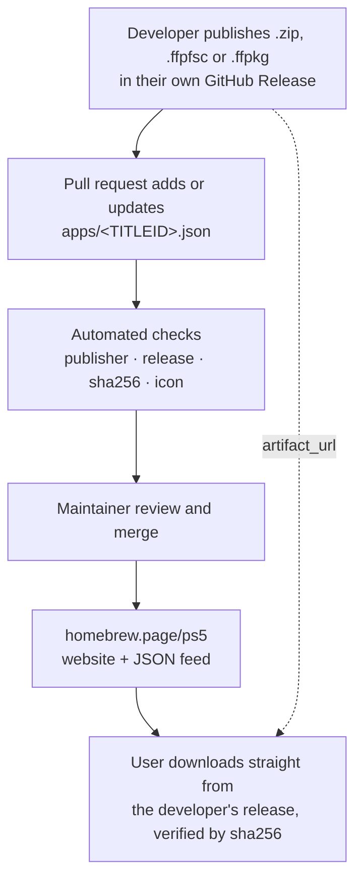

# PS5 Homebrew Catalog

[](https://github.com/blackbearreloaded/ps5-homebrew-catalog/actions/workflows/ci.yml)
[](https://github.com/blackbearreloaded/ps5-homebrew-catalog/actions/workflows/health.yml)

A community-maintained index of **native PS5 homebrew apps**. Each app is one
small JSON record that points to a release file its developer hosts in their
own GitHub Releases. This repository stores no binaries.

**Native apps only.** Every listing is an application built for the PS5 that
installs as a title with its own title ID (`eboot.bin` and `sce_sys/`). ELF
payloads, PS4 packages, backports, emulator ROMs and web pages aren't listed.

The records here are the source of the [PS5 homebrew website](https://homebrew.page/ps5/),
and they will feed a console-side store that can install listed apps.

## How it works



1. A developer publishes a versioned artifact in their project's GitHub Releases.
2. They open a pull request that adds or updates `apps/<TITLEID>.json`.
3. Automation verifies the record, the publisher, the release, the exact bytes
   (sha256), and the icon.
4. A maintainer reviews and merges; the website and feed are rebuilt from `main`.

Downloads always come from the developer's own release, pinned by sha256, so a
listed app can't be silently replaced.

## Add your app

Read **[Submitting an app](docs/submitting.md)**. In short:

1. Package your app as a `.zip` app folder, `.ffpfsc` image or `.ffpkg`
   ([artifact formats](docs/artifact-formats.md)).
2. Publish it in a release of your public GitHub repository.
3. Add `apps/<TITLEID>.json` from the account that owns that repository.
4. Open a pull request and fix anything the checks report.

## Record format

One file per app, named after its title ID, with exactly these eleven string fields:

```json
{
  "titleid": "PPSA01234",
  "name": "Example App",
  "kind": "app",
  "description": "One short sentence about the app.",
  "license": "GPL-3.0",
  "author": "Example Dev",
  "version": "01.000.000",
  "source_repo": "https://github.com/example/example-app",
  "artifact_url": "https://github.com/example/example-app/releases/download/01.000.000/PPSA01234.zip",
  "sha256": "2432640a5dc4a4cb57ffcdb2ce347329a687ddff526f6e19d0495f1efd136317",
  "icon_url": "https://raw.githubusercontent.com/example/example-app/01.000.000/sce_sys/icon0.png"
}
```

Field rules and limits are in **[Metadata format](docs/metadata.md)**.

## Reserve a title ID

Title IDs are first come, first served. If your app isn't released yet, you can
claim its title ID now with the same eleven-field record, leaving the links
empty. The website shows it as **Coming soon**, with no download.

1. Add `apps/<TITLEID>.json` with `source_repo`, `artifact_url` and `icon_url`
   set to `null` (and `sha256` too, since there's no file yet):

   ```json
   {
     "titleid": "PPSA01234",
     "name": "Example Game",
     "kind": "game",
     "description": "One short sentence about the game.",
     "license": null,
     "author": "Example Dev",
     "version": null,
     "source_repo": null,
     "artifact_url": null,
     "sha256": null,
     "icon_url": null
   }
   ```

   `version` and `license` can be `null` or filled in if you already know them.
2. Open a pull request. Any GitHub account can reserve a free title ID; the
   reservation belongs to **the account that opens the pull request**.
3. When you release, fill in every field (the [release record](#record-format))
   in a new pull request from the same account. Only that account can update or
   release the reservation, and releasing also requires owning `source_repo`.

Limits that keep reservations fair: at most **5 per GitHub account**, and a
reservation left unchanged for **180 days** is flagged by the health
check and may be released. Details are in
[Reserving a title ID](docs/submitting.md#reserving-a-title-id) and the
[review policy](docs/review-policy.md#reservations).

## What gets checked

| Check | Pull request | Push to `main` | Weekly (daily rotation) |
| --- | :---: | :---: | :---: |
| JSON format, fields, text, URLs, uniqueness | ✓ | ✓ | ✓ |
| Only `apps/<TITLEID>.json` changed, one app per PR | ✓ | | |
| Submitter owns the source repository | ✓ | | |
| Reservations: only the reserving account may change them, 5 per account | ✓ | | |
| Reservations unchanged for 180 days (report only) | | | ✓ |
| Release, asset and license exist and match | ✓ | ✓ | ✓ |
| GitHub's digest of the asset matches `sha256` (nothing downloaded) | ✓ | ✓ | ✓ |
| Icon is a reachable PNG, JPEG or WebP image | ✓ | ✓ | ✓ |
| Newer upstream release: daily pull request with the update | | | ✓ |

Pushes to `main` verify only the records they change; the daily health check
covers the whole catalog once a week. Artifacts are never downloaded: the
sha256 is checked against the digest GitHub computes for each release asset. See
**[Automation](docs/automation.md)** for how the checks work and why they are safe
to run on untrusted pull requests.

## Website

GitHub Actions rebuilds the store from `main` after every merge and deploys it
to Cloudflare Pages. The catalog
page switches between cards and a list in place, with shared search, filters
and sorting; app pages open without reloads; it works on phones, shows when each app was last updated, and publishes a JSON feed at
`/ps5/catalog/v1.json` for the console store and other clients. See **[Website](docs/website.md)** for the output, themes, local
preview and the Cloudflare deployment (no Cloudflare credentials in the
repository).

## Trust and safety

Listing means the automated checks passed and a maintainer reviewed the
submission's publisher and provenance. It is **not** a security audit of the
app's code. See the **[review policy](docs/review-policy.md)** for how listings,
updates, title ID disputes and withdrawals are handled.

Report a broken or incorrect listing with an
[issue](https://github.com/blackbearreloaded/ps5-homebrew-catalog/issues/new/choose).
Report a malicious or compromised app privately as described in
[SECURITY.md](SECURITY.md).

## Disclaimer

Each app is published by its own developer, who alone is responsible for it:
its licensing, its content, what it includes or downloads, and whether it is
lawful to distribute and use. This catalog only links to files the developers
host in their own GitHub Releases; it doesn't host, modify or distribute them.
Listings, the website and the feed are provided as-is, without warranty of any
kind, and the maintainers accept no liability for listed apps or their content.
Some apps need extra setup, such as a payload, configuration or additional
files: always read each app's release notes and documentation, linked from its
page, before installing. Use homebrew at your own risk.

If a listing infringes your rights or includes illegal content, report it
through an [issue](https://github.com/blackbearreloaded/ps5-homebrew-catalog/issues/new/choose)
or privately as described in [SECURITY.md](SECURITY.md); it will be withdrawn
(see the [review policy](docs/review-policy.md#withdrawals)).

## Repository layout

```text
apps/                 One <TITLEID>.json record per app
catalog/              Checker, verifier and site generator (Python standard library)
site/                 Website themes, templates and shared assets
tests/                Unit and end-to-end tests for the checker
docs/                 Submission guide, formats, policy, automation, website
docs/maintainers/     Maintainer runbooks (listing a developer's app, for people and AI agents)
.github/workflows/    Submission check, CI and deploy, daily health check, release updates
```

## Run the checks locally

Python 3.10 or newer, no dependencies:

```sh
python3 -m catalog check                  # offline: every record's format
python3 -m catalog verify PPSA01234       # online: release, sha256, icon
python3 -m catalog digest <artifact_url>  # print the sha256 GitHub reports
python3 -m catalog build                  # build the website into dist/
python3 -m unittest discover -s tests     # checker tests
```

Set `GITHUB_TOKEN` to avoid GitHub's anonymous API rate limit.

## License

The catalog tooling and documentation are licensed under [GPL-3.0](LICENSE).
Each listed app is distributed by its own developer under the license in its record.
