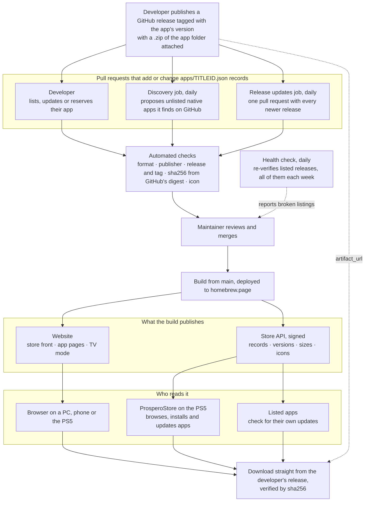

# PS5 Homebrew Catalog

[](https://github.com/blackbearreloaded/ps5-homebrew-catalog/actions/workflows/ci.yml)
[](https://github.com/blackbearreloaded/ps5-homebrew-catalog/actions/workflows/health.yml)

A community-maintained index of **native PS5 homebrew apps**. Each app is one
small JSON record that points to a release file its developer hosts in their
own GitHub Releases. This repository stores no binaries.

> [!IMPORTANT]
> **This catalog is an aggregator.** It lists apps; it doesn't build, maintain
> or support them. Each app belongs to its own developer. For a bug, a question
> or a feature request about an app, go to that app's GitHub repository (the
> **Source code** link on its page at [homebrew.page](https://homebrew.page/),
> or `source_repo` in its record) and contact its developer there. Issues here
> are for the catalog itself: a wrong or broken listing, the website or the
> store API.

**Native apps only.** Every listing is an application built for the PS5 that
installs as a title with its own title ID (`eboot.bin` and `sce_sys/`). ELF
payloads, PS4 packages, backports, emulator ROMs and web pages aren't listed.

The records here are the source of the [PS5 homebrew website](https://homebrew.page/)
and of the store API that [ProsperoStore](https://github.com/blackbearreloaded/ProsperoStore)
reads to install listed apps on the console.

## How it works



1. A developer publishes a GitHub release of their project, tagged with the app's
   version, with the app attached.
2. A pull request adds or updates `apps/<TITLEID>.json`. It comes from the
   developer, or from one of two daily jobs: **discovery**, which searches public
   GitHub for native apps that aren't listed yet (one pull request per app), and
   **release updates**, which moves listed apps to their newest release (all in
   one pull request).
3. Automation verifies the record, the publisher, the release and its tag, the
   exact bytes (sha256, from GitHub's digest; nothing is downloaded), and the icon.
4. A maintainer reviews and merges; nothing is listed automatically. The website
   (store front, app pages and TV mode) and the signed [store API](docs/api.md)
   are rebuilt from `main`.
5. People browse the website; [ProsperoStore](https://github.com/blackbearreloaded/ProsperoStore)
   reads the store API on the PS5 to browse, install and update apps; and a
   listed app can read it to tell its user that an update exists.
6. A daily health check re-verifies the listed releases (the whole catalog each
   week) and reports any that broke.

Downloads always come from the developer's own release, pinned by sha256, so a
listed app can't be silently replaced.

## Add your app

Read **[Submitting an app](docs/submitting.md)**. In short:

1. Package your app as a `.zip` of its app folder, the only format accepted
   at the moment ([artifact formats](docs/artifact-formats.md)).
2. Publish it in a GitHub release of your public repository, **tagged with the
   app's version** (e.g. `v1.2.0`). The tag is the version the catalog shows.
3. Add `apps/<TITLEID>.json` from the account that owns that repository.
4. Open a pull request and fix anything the checks report.

## Write release notes

The text you write on your GitHub release is your app's **release notes** in
the catalog: it appears on the app's page and in the store API, where
ProsperoStore and other clients can show it. You write it in one place, on the
release, and nothing goes in the record. Notes are optional, and the catalog
picks up later edits within about a day of the next site build.

The catalog reads GitHub Markdown and keeps only **headings, paragraphs and
lists** (with bold and inline code on the website). A console shows it as plain
text. So:

- **Start with what changed.** The website shows about the first 1,800
  characters and the API the first 4,000, cut at the end of a line, with a link
  to the full release. Put changes first; install steps, requirements and
  hashes last.
- **Use short headings and flat bullet lists**, such as `### Added`, `### Fixed`
  and `### Changed`. Nested lists are flattened, and a table becomes one line
  per row.
- **Don't rely on images, badges, links or HTML.** Images and badges are
  dropped, a link keeps its text but not its address, and HTML tags are
  removed. Write "see the README" rather than "click here".
- **Write it yourself.** A release with no text, or with only GitHub's generated
  "Full Changelog" link or "What's Changed" list heading, has no notes in the
  catalog.
- **Keep it readable as plain text**, in any language. Emoji and unusual symbols
  may not exist in a console's font.

A release body that reads well everywhere:

```markdown
A small update with fixes and two new languages.

### Added
- Spanish and French. The app follows the console's language.

### Fixed
- The detail page no longer shifts its buttons while it loads.
- Playback resumes at the right position after rest mode.

### Install
Unzip `PPSA12345.zip` and copy the `PPSA12345` folder to `/data/homebrew/`.
```

The notes are yours: the catalog shows them as your words and doesn't review
them. [Store API: release notes](docs/api.md#release-notes) has the exact
format clients receive.

## Record format

One file per app, named after its title ID, with exactly these eleven string fields:

```json
{
  "titleid": "PPSA01234",
  "name": "Example App",
  "kind": "app",
  "description": "One short sentence about the app.",
  "license": "GPL-3.0",
  "author": "Example Dev",
  "version": "01.000.000",
  "source_repo": "https://github.com/example/example-app",
  "artifact_url": "https://github.com/example/example-app/releases/download/01.000.000/PPSA01234.zip",
  "sha256": "2432640a5dc4a4cb57ffcdb2ce347329a687ddff526f6e19d0495f1efd136317",
  "icon_url": "https://raw.githubusercontent.com/example/example-app/01.000.000/sce_sys/icon0.png"
}
```

Field rules and limits are in **[Metadata format](docs/metadata.md)**.

## Reserve a title ID

Title IDs are first come, first served. If your app isn't released yet, you can
claim its title ID now with the same eleven-field record, leaving the links
empty. The website shows it as **Coming soon**, with no download.

1. Add `apps/<TITLEID>.json` with `source_repo`, `artifact_url` and `icon_url`
   set to `null` (and `sha256` too, since there's no file yet):

   ```json
   {
     "titleid": "PPSA01234",
     "name": "Example Game",
     "kind": "game",
     "description": "One short sentence about the game.",
     "license": null,
     "author": "Example Dev",
     "version": null,
     "source_repo": null,
     "artifact_url": null,
     "sha256": null,
     "icon_url": null
   }
   ```

   `version` and `license` can be `null` or filled in if you already know them.
2. Open a pull request. Any GitHub account can reserve a free title ID; the
   reservation belongs to **the account that opens the pull request**.
3. When you release, fill in every field (the [release record](#record-format))
   in a new pull request from the same account. Only that account can update or
   release the reservation, and releasing also requires owning `source_repo`.

Limits that keep reservations fair: at most **5 per GitHub account**, and a
reservation left unchanged for **180 days** is flagged by the health
check and may be released. Details are in
[Reserving a title ID](docs/submitting.md#reserving-a-title-id) and the
[review policy](docs/review-policy.md#reservations).

## What gets checked

| Check | Pull request | Push to `main` | Weekly (daily rotation) |
| --- | :---: | :---: | :---: |
| JSON format, fields, text, URLs, uniqueness | ✓ | ✓ | ✓ |
| Only `apps/<TITLEID>.json` changed, one app per PR | ✓ | | |
| Submitter owns the source repository | ✓ | | |
| Reservations: only the reserving account may change them, 5 per account | ✓ | | |
| Reservations unchanged for 180 days (report only) | | | ✓ |
| Release, asset and license exist and match | ✓ | ✓ | ✓ |
| GitHub's digest of the asset matches `sha256` (nothing downloaded) | ✓ | ✓ | ✓ |
| Icon is a reachable PNG, JPEG or WebP image | ✓ | ✓ | ✓ |
| Content version (`contentVersion`) readable and raised; warning only | ✓ | ✓ | ✓ |
| Release scan: the ZIP is read, never run, for ways out of the sandbox, unreviewed helpers and changes since the listed release; report for the reviewer | ✓ | | |
| Release scan summaries for the site's Safety labels and the API | | ✓ | |
| Newer upstream release: daily pull request with the update | | | ✓ |
| Unlisted native apps on GitHub: daily listing pull requests to review | | | ✓ |

Pushes to `main` verify only the records they change; the daily health check
covers the whole catalog once a week. Artifacts are never downloaded: the
sha256 is checked against the digest GitHub computes for each release asset. See
**[Automation](docs/automation.md)** for how the checks work and why they are safe
to run on untrusted pull requests.

## Website

GitHub Actions rebuilds the store from `main` after every merge and deploys it
to Cloudflare Pages. The front
page is a store front: featured apps over shelves, with sections for apps, games
and tools, search and sorting; each app has its own page, coloured from its icon; it works on phones, has a TV mode for the PS5 browser and smart TVs
(controller-driven, inspired by [tv4play](https://github.com/ps5-payload-dev/tv4play)), and shows when each app was last updated. See **[Website](docs/website.md)** for the output, themes, local
preview and the Cloudflare deployment (no Cloudflare credentials in the
repository).

## Store API

The same build publishes the catalog for programs at
`https://homebrew.page/api/v1/`: one small JSON file per app, a compact index, a
version map and PNG icons. It is what a console store reads, and what an app
reads to tell its user that an update exists. Besides the records it carries
each release's download size, release date, content version and the developer's
release notes as plain text, all read from GitHub without downloading anything. The deploy signs the catalog, so a store
can verify it is genuine before installing from it.

- **[Store API](docs/api.md)**: the files, every field, how to find updates,
  and how the API is versioned.
- **[App versions](docs/versioning.md)**: for developers, the `contentVersion`
  standard that makes updates visible to consoles.

## Trust and safety

Listing means the automated checks passed and a maintainer reviewed the
submission's publisher and provenance. It is **not** a security audit of the
app's code. See the **[review policy](docs/review-policy.md)** for how listings,
updates, title ID disputes and withdrawals are handled.

Report a broken or incorrect listing with an
[issue](https://github.com/blackbearreloaded/ps5-homebrew-catalog/issues/new/choose).
Report a malicious or compromised app privately as described in
[SECURITY.md](SECURITY.md).

## Disclaimer

Each app is published by its own developer, who alone is responsible for it:
its licensing, its content, what it includes or downloads, and whether it is
lawful to distribute and use. This catalog only links to files the developers
host in their own GitHub Releases; it doesn't host, modify or distribute them.
Listings, the website and the feed are provided as-is, without warranty of any
kind, and the maintainers accept no liability for listed apps or their content.
Some apps need extra setup, such as a payload, configuration or additional
files: always read each app's release notes and documentation, linked from its
page, before installing. Use homebrew at your own risk.

If a listing infringes your rights or includes illegal content, report it
through an [issue](https://github.com/blackbearreloaded/ps5-homebrew-catalog/issues/new/choose)
or privately as described in [SECURITY.md](SECURITY.md); it will be withdrawn
(see the [review policy](docs/review-policy.md#withdrawals)).

## Repository layout

```text
apps/                 One <TITLEID>.json record per app
catalog/              Checker, verifier, site generator and discovery job (Python standard library)
keys/                 Public keys the store API is signed with (the private keys are never here)
discovery/            Repositories the discovery job never proposes (ignore.txt)
site/                 Website themes, templates and shared assets
tests/                Unit and end-to-end tests for the checker
docs/                 Submission guide, formats, versions, store API, policy, automation, website
docs/maintainers/     Maintainer runbooks (listing a developer's app, for people and AI agents)
.github/workflows/    Submission check, CI and deploy, daily health check, release updates, discovery
```

## Run the checks locally

Python 3.10 or newer, no dependencies:

```sh
python3 -m catalog check                  # offline: every record's format
python3 -m catalog verify PPSA01234       # online: release, sha256, icon
python3 -m catalog digest <artifact_url>  # print the sha256 GitHub reports
python3 -m catalog build                  # build the website into dist/
python3 -m unittest discover -s tests     # checker tests
```

Set `GITHUB_TOKEN` to avoid GitHub's anonymous API rate limit.

<!-- bbr-footer:start -->
<!-- Generated by ps5-homebrew-dev-protocol/scripts/readme-footer. Edit the template there, not here. -->

## Credits

Thanks to John Törnblom (ps5-payload-dev) for the [PS5 Payload SDK](https://github.com/ps5-payload-dev/sdk), which much of the PS5 homebrew scene is built on.
Third-party components, authors and licenses are listed in
[THIRD_PARTY_NOTICES.md](THIRD_PARTY_NOTICES.md).

## License

Copyright © 2026 BlackBearReloaded. Licensed under GPL-3.0-or-later; see [LICENSE](LICENSE). Third-party components keep their own licenses. Each listed app is distributed by its own developer under the license in its record.

## Disclaimer

- **No affiliation.** This is an independent homebrew project. It is not
  affiliated with, endorsed by, or sponsored by Sony Interactive Entertainment.
  "PlayStation", "PS5" and related marks are trademarks of Sony Interactive
  Entertainment Inc.
- **No proprietary material.** No Sony SDK, firmware, encryption keys or
  decrypted system modules are included.
- **No warranty.** This project is provided "as is", without warranty of any
  kind, to the extent permitted by law. See sections 15 and 16 of the GPL.
- **Legal use only.** Use it only with hardware, accounts and content you own.
  This project does not support or enable piracy.

## AI assistance

This project was developed with AI assistance from OpenAI and/or Anthropic tools.
<!-- bbr-footer:end -->
